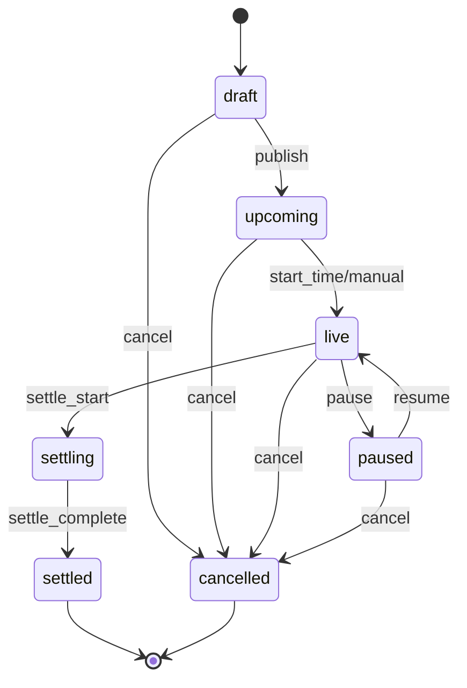

# TradeXa — Market Lifecycle Guide

## Market Lifecycle Overview

A prediction market progress follows a structured sequence of states to manage user trading and platform payouts correctly:

## Market Status Definitions

1. **`draft`**: The initial created state. Only visible to admins. Edits allowed.
2. **`upcoming`**: The market is published and visible to users, but trading is not yet open.
3. **`live`**: Trading is active. Users can buy YES or NO shares.
4. **`paused`**: Admin suspended trading temporarily due to an event/investigation. Buy and sell operations are blocked.
5. **`settling`**: A transient database state locking the market during settlement processing to prevent race conditions.
6. **`settled`**: The final resolved state with a marked winning outcome. Payouts have been distributed.
7. **`cancelled`**: The market was aborted. All open trades are fully refunded back to the users' points balances.

## Transition Guards & Refund Side-Effects
- State transitions are strictly enforced via the `is_valid_market_transition` helper matrix.
- Moving to `cancelled` initiates an automatic refund sweep:
  - Fetches all open trades for the market.
  - Updates trade statuses to `cancelled`.
  - Credits the exact points costs (`total_cost`) back to users via `credit_points` with a `refund` entry type.
